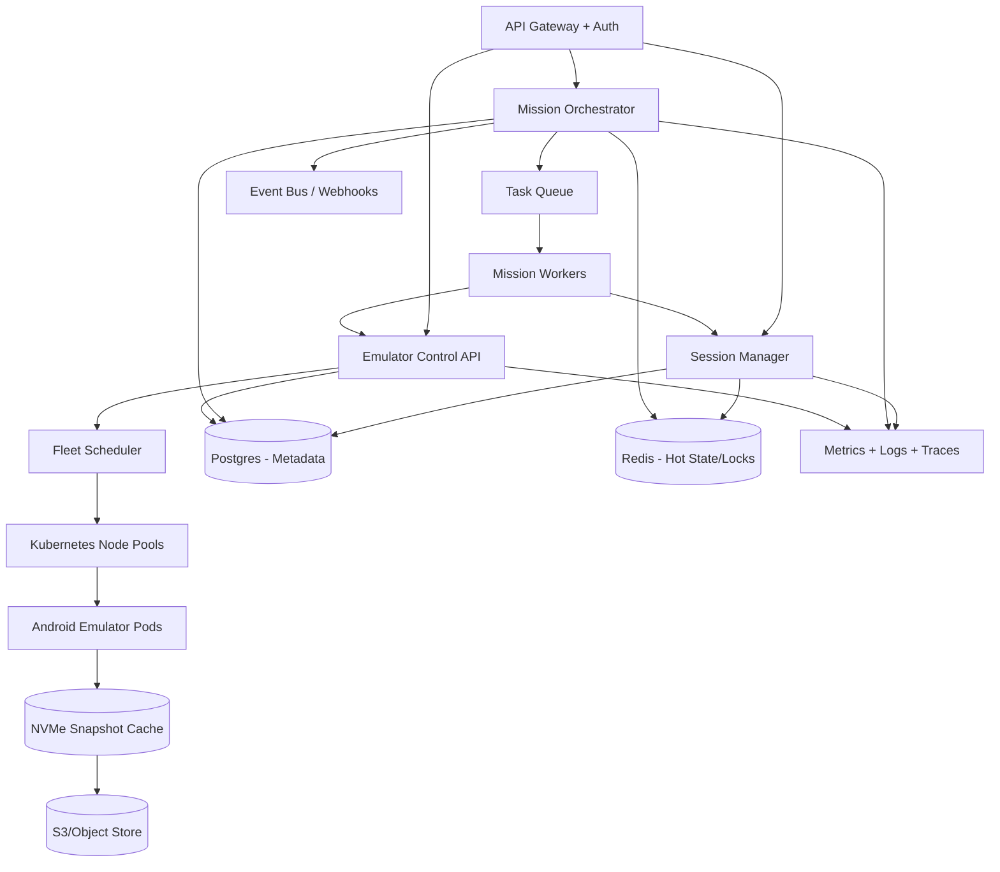

# Production Architecture Plan (Part 4)

Client (User/API)
        ↓
Mission Service (Orchestrator)
        ↓
Session Service (Session validation)
        ↓
Emulator Service (Provision + snapshots)
        ↓
Postgres (state) + Redis (fast ops)
        ↓
Snapshots Volume (session restore)

## Scope and Target

This document describes how to evolve the prototype to production for:
- `10,000` concurrent users
- `5-15` connected apps per user
- roughly `100,000` active user-app sessions at steady state

Design priorities:
1. High mission success rate with bounded latency
2. Cost-aware emulator usage (hot vs on-demand)
3. Fast snapshot restore for session continuity
4. Predictable behavior under partial failures

## High-Level Production Architecture

## 1. Emulator Fleet Sizing and Cost Model

## Workload model

Assumptions:
- Average connected apps per user: `10`
- Session count: `10,000 x 10 = 100,000`
- Concurrent mission execution touching emulator at any moment: `12-18%` of users
- Average tasks per mission: `2.5`

Estimated concurrent emulator demand:
- Baseline active emulators: `1,200-1,800`
- Add `20%` burst headroom: `1,440-2,160`
- Keep warm standby at `15-20%` of baseline active: `220-430`

Target total managed capacity: `1,700-2,500` emulator slots.

## Instance strategy

Example split:
- Hot fleet: compute-optimized instances with local NVMe (for low-latency restores)
- On-demand burst fleet: autoscaled node group spun from queue depth

Per-node density (conservative):
- `10-14` emulators/node depending on app mix and CPU throttling policy

For `2,000` emulator slots at `12` density:
- ~`167` active nodes

## Rough monthly cost estimate (as of April 2026, ballpark)

- Hot nodes (`140`) x `$0.70/hr` x `730h` = `$71,540/month`
- Burst nodes avg (`27`) x `$0.70/hr` x `730h` x `0.45 utilization` = `$6,205/month`
- Control plane, NAT, monitoring, data transfer, buffer = `$8k-12k/month`

Estimated total: `$85k-90k/month` infra-only at this scale.

Optimization levers:
- Increase snapshot hit ratio on hot cache
- Improve tiering so low-value sessions become cold/on-demand
- Reduce emulator CPU over-allocation by workload-aware scheduling

## 2. Snapshot Storage for 50K-150K Sessions

## Layering strategy

Use 3 layers:
1. Base Android image layer (shared globally per version)
2. App layer (shared by app version)
3. Session delta layer (per user-app)

This minimizes duplicate storage and transfer.

## Size model

Assumptions:
- Base layer: `~6 GB` (single shared artifact per Android image)
- App layer avg compressed: `~200 MB` (per app version)
- Session delta avg compressed: `~40 MB`

For `150,000` session snapshots:
- Session deltas: `150,000 x 40 MB = ~6.0 TB`
- App layers: e.g., `300 versions x 200 MB = ~60 GB`
- Base layers: small compared to session volume

Total practical storage: ~`6.2-7.5 TB` (with metadata + replicas).

## Tiering and retrieval

- L1: local NVMe cache on emulator nodes (most recent/hot snapshots)
- L2: regional object store (S3 compatible) as source of truth
- L3: archival tier for stale snapshots (>90 days)

Latency targets:
- Hot cache restore p95: `<8s`
- Object store restore p95: `<20s`
- Mission allocation decision p95: `<1s`

Controls:
- Content-addressed chunks + dedupe
- Compression (zstd/lz4 depending on CPU budget)
- Async prefetch for predicted next app/session

## 3. Session Health at 100K Scale

## Tier policy

- Hot: daily checks (recently used, high-value)
- Warm: weekly checks
- Cold: on-demand at mission time only

Example distribution:
- Hot: `15,000`
- Warm: `45,000`
- Cold: `40,000`

Daily check volume:
- Hot: `15,000/day`
- Warm: `45,000/7 ~= 6,430/day`
- Total scheduled checks/day: `~21,430`

If each check takes `8s` emulator time equivalent:
- `21,430 x 8s = 171,440s/day` (~`47.6` emulator-hours/day)
- Small dedicated verification pool can handle this cheaply.

## Scheduler approach

- Priority queue with jittered scheduling windows
- Backpressure controls per app/domain
- Max concurrent checks per tier
- Circuit breaker when dependency (emulator pool/object store) is degraded

Freshness SLA:
- Hot sessions: verified in last 24h (p95)
- Warm sessions: verified in last 7d (p95)
- Cold sessions: verified at mission allocation time

## 4. Top 5 Failure Modes, Detection, Mitigation

1. Emulator node saturation / noisy neighbor
- Detect: rising boot time p95, CPU steal, queue depth
- Mitigate: workload bin-packing limits, horizontal autoscale, node quarantine

2. Snapshot restore latency spikes (object store/network)
- Detect: restore p95/p99 SLO breach, cache miss surge
- Mitigate: prefetch hot sets, multi-part parallel fetch, regional replica fallback

3. Session classifier drift / false-expired spikes
- Detect: sudden jump in `expired` ratio by app version
- Mitigate: canary classifier rollout, confidence thresholds, human override workflow

4. Mission orchestrator partial outage
- Detect: stuck tasks in `allocating`/`executing`, worker heartbeat loss
- Mitigate: durable queue, idempotent task execution keys, replay-safe state transitions

5. Identity-gate callback loss/timeouts
- Detect: accumulation in `identity_gate`, approval mismatch alerts
- Mitigate: retryable callback endpoint, signed approval tokens, configurable timeout policy (`fail`/`skip`)

## 5. Operational Model and SLOs

Core SLOs:
- Mission API availability: `99.9%`
- Mission completion success (excluding explicit re-auth): `>=98%`
- Emulator provision latency p95: `<30s` from session snapshot
- Session freshness compliance:
  - Hot: `>=95%` within 24h
  - Warm: `>=95%` within 7d

Observability:
- Structured events for each task transition
- Metrics: queue depth, transition latency, restore latency, gate timeout rate
- Distributed tracing across Mission -> Session -> Emulator calls

## 6. Rollout Plan

Phase 1 (Current prototype+):
- Docker Compose + mocked emulator runtime
- Basic state machine and health checks

Phase 2:
- Kubernetes deployment
- Durable queue and worker autoscaling
- Snapshot object-store backend + node-local cache

Phase 3:
- Multi-region failover
- Cost-based scheduling and predictive prewarming
- Advanced mission planner and policy engine

## Tradeoff Summary

- Keep orchestration explicit and observable instead of over-optimizing early.
- Spend compute where it buys latency (hot cache, warm pool), not blanket prewarming.
- Treat `re_auth_required` as recoverable workflow state, not catastrophic failure.
