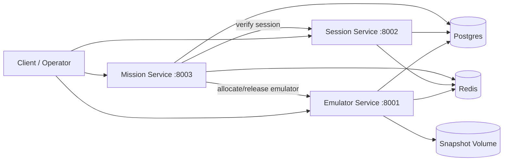

# Drizz SRE Assignment - Mobile Agent Infrastructure

Prototype implementation for:
1. Emulator Orchestration Layer
2. Session Lifecycle Manager
3. Mission Execution Pipeline
4. Production-scale architecture document (`ARCHITECTURE.md`)

## Architecture Overview



## Services

- `emulator_service` (`:8001`): emulator pool, snapshot create/restore, health monitoring, warm-pool auto-replenish.
- `session_service` (`:8002`): user-app session model, session verification (`80/20` mock classifier), health history, tiering.
- `mission_service` (`:8003`): mission intake, decomposition, task state machine, identity-gate pause/resume.
- `postgres` (`:5432`) shared metadata store.
- `redis` (`:6379`) placeholder infra dependency.

## Quick Start

### Prerequisites

- Docker + Docker Compose

### Run

```bash
docker compose up -d --build
```

Health checks:

```bash
curl http://localhost:8001/health
curl http://localhost:8002/health
curl http://localhost:8003/health
```

Stop:

```bash
docker compose down
```

If you changed DB enums/model and want a clean run:

```bash
docker compose down -v
```

## Environment Knobs

### Emulator Service

- `WARM_POOL_SIZE` (default `3`)
- `SNAPSHOTS_DIR` (default `/app/snapshots`)

### Session Service

- `HOT_CHECK_INTERVAL_SECONDS` (default `3600`)
- `WARM_CHECK_INTERVAL_SECONDS` (default `21600`)
- `REBALANCE_INTERVAL_SECONDS` (default `21600`)
- `HOT_FRESHNESS_HOURS` (default `24`)
- `WARM_FRESHNESS_DAYS` (default `7`)

### Mission Service

- `GATE_TIMEOUT_SECONDS` (default `300`)
- `GATE_TIMEOUT_POLICY` (`fail` or `skip`, default `fail`)
- `MISSION_EVENT_WEBHOOK_URL` (optional webhook sink for mission/task events)

## API Documentation

## Emulator Service (`/emulators`)

- `POST /emulators`
  - Provision emulator from optional `snapshot_id`.
- `GET /emulators/pool/status`
  - Warm pool stats.
- `GET /emulators/{id}`
- `GET /emulators/{id}/status` (assignment-compatible alias)
- `POST /emulators/{id}/snapshot`
  - Create `base | app | session` layered snapshot.
- `POST /emulators/{id}/assign?task_id=...`
- `POST /emulators/{id}/release`
- `DELETE /emulators/{id}`

## Session Service (`/users`)

- `POST /users/{user_id}/sessions`
  - Register session snapshot/login method for app.
- `GET /users/{user_id}/sessions`
- `POST /users/{user_id}/sessions/{app_id}/verify`
  - Returns:
    - `health: alive|expired|unknown`
    - `re_auth_required: bool`
    - `login_method` (only when expired)
    - `snapshot_id`
- `GET /users/{user_id}/sessions/{app_id}/health-history`

## Mission Service (`/missions`)

- `POST /missions`
  - Accepts tasks and runs mission async.
  - Supports task input key as `app` (assignment payload style) or `app_id`.
  - Decomposition rule: payment/checkout/book/purchase/renew/confirm goals are chained to prior task if dependency missing.
- `GET /missions/{id}`
- `POST /missions/{id}/tasks/{task_id}/approve`
  - Approves identity gate and resumes task.

Task state machine:

- `queued -> allocating -> executing -> identity_gate -> completing -> done|failed`
- `re_auth_required` when session is expired (lazy re-auth flag, no immediate hard failure)

## End-to-End Demo Flow

1. Create sessions:

```bash
curl -X POST http://localhost:8002/users/u123/sessions \
  -H "content-type: application/json" \
  -d '{"app_id":"com.makemytrip","login_method":"otp","snapshot_id":"snap-mmt-1"}'
```

2. Submit mission:

```bash
curl -X POST http://localhost:8003/missions \
  -H "content-type: application/json" \
  -d '{
    "user_id":"u123",
    "tasks":[
      {"app":"com.makemytrip","goal":"Search flights BLR to JAI Mar 27"},
      {"app":"com.furlenco","goal":"Check renewal amount"}
    ]
  }'
```

3. Poll mission:

```bash
curl http://localhost:8003/missions/<mission_id>
```

4. If a task is at `identity_gate`, approve:

```bash
curl -X POST http://localhost:8003/missions/<mission_id>/tasks/<task_id>/approve
```

## Assignment Mapping

- Part 1: emulator lifecycle APIs, layered snapshots, warm pool, health checks + auto-recovery.
- Part 2: users/apps/sessions model, 80/20 session verification mock, tier rebalance, health history APIs.
- Part 3: mission API, decomposition, parallel + dependency-aware execution, identity checkpoint pause/resume + timeout policy, transition/event observability.
- Part 4: see `ARCHITECTURE.md`.

## Assumptions

- Emulator runtime is mocked (`MockAndroid`) for assignment speed.
- Snapshot files are simulated metadata artifacts in mounted volume.
- Mission decomposition uses deterministic heuristics; full NLP planner is out-of-scope.
- Event delivery uses logs by default and optional webhook posting when configured.

## Known Limitations

- No authentication/authorization layer on APIs.
- No migration framework (tables created with SQLAlchemy `create_all`).
- Mission dependency inference is heuristic and intentionally simple.
- No dedicated dead-letter queue or retry worker for failed webhook deliveries.
